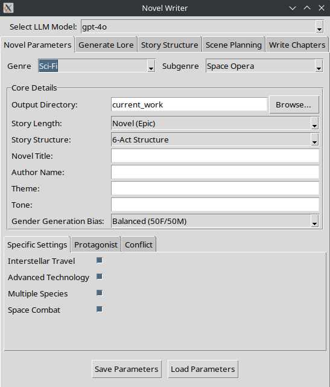

# NovelWriter

## Description

NovelWriter is a comprehensive Python application designed to assist authors in writing novels and short stories across **multiple genres** by leveraging Large Language Models (LLMs). It provides a GUI-based interface built with Tkinter for managing novel parameters, generating universe lore, outlining story structure, planning scenes, and writing chapter prose.

**🎯 Supported Genres:**

- **Sci-Fi** (Space Opera, Hard Sci-Fi, Cyberpunk, Time Travel, Post-Apocalyptic, Biopunk)
- **Fantasy** (High Fantasy, Dark Fantasy, Urban Fantasy, Sword and Sorcery, Mythic Fantasy, Fairy Tale)
- **Historical Fiction** (Ancient History, Medieval, Renaissance, Colonial America, Civil War Era, World War Era)
- **Horror** (Gothic Horror, Psychological Horror, Supernatural Horror, Body Horror, Cosmic Horror, Slasher)
- **Mystery** (Cozy Mystery, Hard-boiled Detective, Police Procedural, Amateur Sleuth, Legal Thriller, Forensic Mystery)
- **Romance** (Contemporary Romance, Historical Romance, Paranormal Romance, Romantic Suspense, Regency Romance, Western Romance)
- **Thriller** (Espionage Thriller, Psychological Thriller, Action Thriller, Techno-Thriller, Medical Thriller, Legal Thriller)
- **Western** (Traditional Western, Weird Western, Space Western, Modern Western, Outlaw Western, Cattle Drive Western)

Each genre features specialized faction generation, character creation, and world-building tailored to genre conventions and tropes.



The application features a dynamic LLM model selector, allowing users to choose from various supported models for different generation tasks. Currently configured models include:

*   OpenAI GPT-4o, o1, o1-mini o3, o4-mini
*   Gemini 1.5, 2.0, 2.5 pro
*   Claude 3.5, 3.7 Sonnet
*   *(You can add/remove models by configuring `ai_helper.py`)*

Running this code requires API keys for the specific LLMs you intend to use (e.g., an **OpenAI API key** for GPT models, a **Google AI API key** for Gemini models, **Anthropic API Key** for Claude models). These keys should be stored in a `.env` file in the project's root directory.

While many steps are automated, the output often serves as a strong starting point that can be further refined by the author.

## ✨ Key Features

- **Multi-Genre Support**: Comprehensive support for 8 major genres with genre-specific world-building
- **Intelligent Character Generation**: Gender-balanced character creation with detailed backgrounds, relationships, and family trees
- **Dynamic Faction Systems**: Genre-appropriate organizational structures (factions, agencies, social groups, cults, etc.)
- **Configurable Story Structures**: Support for multiple narrative frameworks (3-Act, 6-Act, Hero's Journey, Save the Cat!, etc.)
- **Advanced Location Systems**: Genre-specific location generation (planets for sci-fi, cities for fantasy, territories for westerns, etc.)
- **Comprehensive Character Arcs**: Detailed character development with goals, motivations, flaws, and growth arcs
- **Story Arc Integration**: Seamless integration between character arcs, faction politics, and location-based storytelling
- **Flexible Output Formats**: Generate complete manuscripts with proper chapter organization

## Quick Start

**New to NovelWriter?** Check out our [**User Guide**](./docs/user_guide.md) for a step-by-step walkthrough of creating your first novel!

## Examples

Want to see what NovelWriter can create? Check out the [**NovelWriter-Examples**](https://github.com/EdwardAThomson/NovelWriter-Examples) repository, which showcases complete novels and short stories generated using this application.

**Featured Examples:**
- **"Echoes of Terra Nova"** - 52,212 words (Space Opera, generated with OpenAI o1-preview)
- **"Starbound Legacy: The Awakening"** - 50,339 words (Space Opera, generated with GPT-4o)
- **"Project Chimera: The Whisper in the Wires"** - 88,681 words (Space Opera, generated with Gemini 1.5)
- **Short Stories** - Including political drama and character-driven narratives

Each example includes the complete workflow outputs showing all intermediate generation steps, from initial parameters through to final prose, demonstrating how the structured approach produces coherent long-form fiction.

## Setup and Installation

1.  **Clone the Repository:**
    
    ```bash
    git clone https://github.com/EdwardAThomson/NovelWriter.git
    cd NovelWriter
    ```

2.  **Create a Virtual Environment (Recommended):**
It might easiest to open the files in an IDE and let it handle virtual environments automatically.
    
    ```bash
    python -m venv venv
    source venv/bin/activate  # On Windows use `venv\Scripts\activate`
    ```

3.  **Install Dependencies:**
    
    ```bash
    pip install -r requirements.txt
    ```
    * (or `pip install openai python-dotenv google-generativeai anthropic`)
    
4.  **Configure API Keys:**
    *   Create a file named `.env` in the root directory of the project.
    *   Add your API keys to this file in the following format:
        
        ```dotenv
        OPENAI_API_KEY='your_openai_api_key_here'
        GEMINI_API_KEY='your_gemini_api_key_here'
        ANTHROPIC_API_KEY='your_anthropic_api_key_here'
        ```
    *   Replace the placeholder text with your actual keys.

5.  **Run the Application:**
    
    ```bash
    python main.py
    ```

## 🔧 Utility Scripts

### `combine.py` -- build the novel file

Located in the root directory, this script is used to combine all generated chapter markdown files (typically found in `current_work/chapters/`) into a single markdown file. The output file is named after the novel's title (if found in `parameters.txt`) or defaults to `combined_novel.md`, and is saved within the `current_work/chapters/` directory. This is useful for creating a complete manuscript from individual chapter files.

## 📚 Documentation

- **[User Guide](./docs/user_guide.md)** - Step-by-step instructions for using the application
- **[Detailed Documentation](./docs/README.md)** - Comprehensive technical documentation, workflows, and file formats

## 🎭 Genre-Specific Features

### **Sci-Fi**
- Planetary systems with habitable worlds
- Technological factions and space-faring civilizations
- Character attributes: homeworld, home_system

### **Fantasy**
- Regional kingdoms with magical cities
- Guilds, noble houses, and magical orders
- Character attributes: homeland, home_region, race, magic abilities

### **Historical Fiction**
- Period-appropriate factions (royal courts, noble houses, religious orders)
- Historical territories and authentic cultural details
- Character attributes: social_class, historical_period, education_level

### **Horror**
- Cults and supernatural organizations
- Strongholds and haunted locations
- Character attributes: sanity, supernatural_exposure

### **Mystery**
- Law enforcement agencies and criminal organizations
- Investigation territories and crime scenes
- Character attributes: investigative_skills, case_history

### **Romance**
- Social groups and family networks
- Romantic venues and community locations
- Character attributes: relationship_status, social_connections

### **Thriller**
- Intelligence agencies and criminal syndicates
- Operational territories and safe houses
- Character attributes: security_clearance, operational_history

### **Western**
- Frontier towns and territorial organizations
- Trading posts and frontier settlements
- Character attributes: frontier_skills, reputation

## 🚀 The Generation Process

The novel generation process follows these main stages through the UI tabs:

1.  **Novel Parameters (`parameters.py`):** Select genre, subgenre, story length, structure, and configure gender balance. Genre-specific configuration tabs provide tailored options for each genre.

2.  **Generate Lore (`lore.py` & Supporting Modules):**
    *   Generate genre-appropriate factions/organizations using specialized generators
    *   Generate characters with genre-specific attributes and relationships
    *   Enhance main characters with detailed backgrounds, family trees, and faction affiliations
    *   Generate narrative backstories using LLMs with genre-appropriate context
    *   Compile comprehensive lore prompts including world-building details
    *   Generate the main universe lore narrative

3.  **Story Structure (`story_structure.py`):**
    *   Generate Character Arcs based on genre conventions and backstories
    *   Generate Faction Arcs incorporating political dynamics and conflicts
    *   Reconcile Character and Faction Arcs with location-based storytelling
    *   Generate high-level story structure using configurable frameworks
    *   Refine each act/section with detailed plot development

4.  **Scene Planning (`scene_plan.py`):**
    *   Generate chapter outlines based on chosen story structure
    *   Create detailed scene plans with character interactions and plot progression

5.  **Write Chapters (`chapter_writing.py`):**
    *   Generate prose for each scene using comprehensive context
    *   Maintain genre consistency and character voice
    *   Provide functionality to re-write and improve chapters

More details, project history, and ongoing developer insights can be found in our [Developer Diary & Design Notes](./docs/discussion.md).

## 📈 Technical Architecture

NovelWriter uses a modular architecture with:

- **Genre Handlers**: Specialized classes for each genre's unique requirements
- **Configuration System**: Dynamic parameter loading based on genre selection
- **Character Generators**: Genre-specific character creation with appropriate attributes
- **Faction Systems**: Organizational structures tailored to each genre's conventions
- **Story Integration**: Seamless connection between world-building and narrative structure

### Original Version

The original version was created as part of NaNoGenMo 2024 ([**completed**](https://github.com/NaNoGenMo/2024/issues/31)). The first version of the code was pushed to a different repo as I lost access to my GitHub account (fixed!), please find the original repo here: [NovelWriter](https://github.com/edthomson/NovelWriter). That code was not fully automated, but it did generate a 52,000-word novel (Echoes of Terra Nova).
